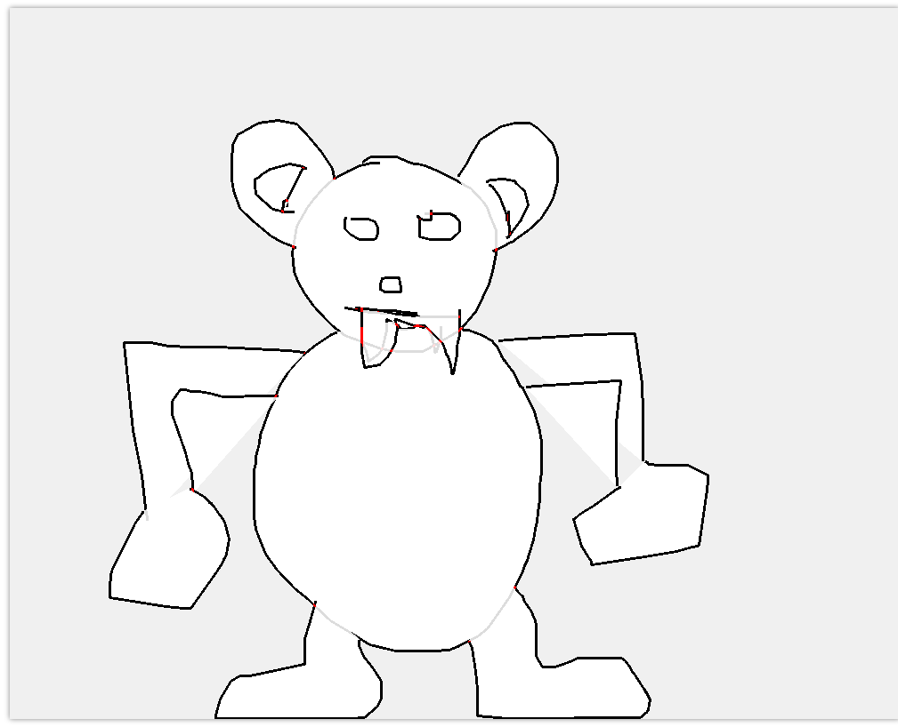
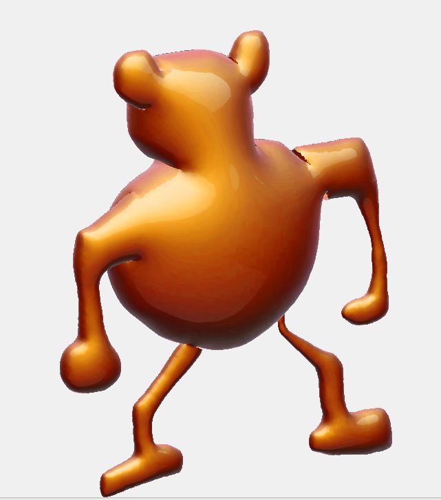
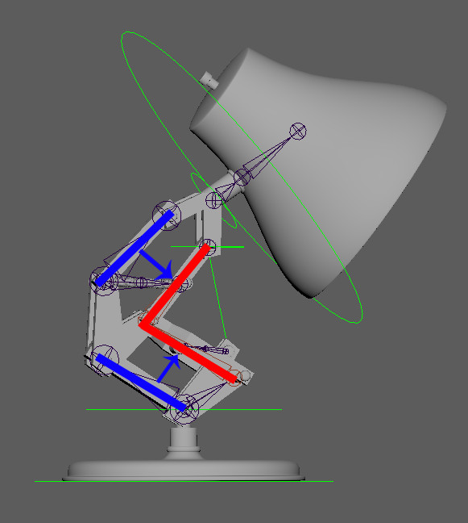
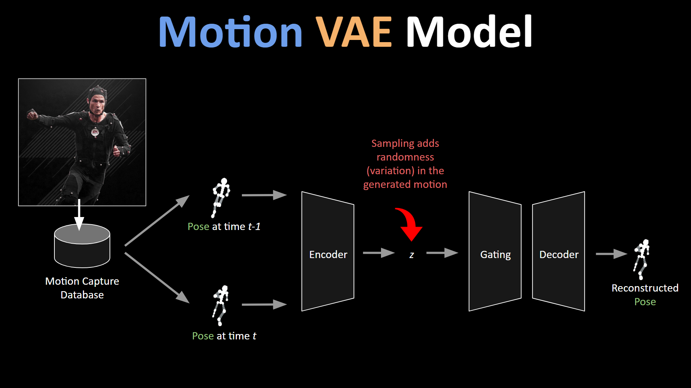

### Lecture 26: Learning
More machine learning + computer graphics.

It will certainly be interesting to see how future computer graphics research
will be infiltrated by ML/deep learning strategies. With already pretty
compelling mocap data results, I personally think it would be interesting to see
if we could use mocap data and one of the previous papers on modeling a primal
skeleton to come up with an even better general model of teh human body.

There's also all the CNN works on facial detection and differentiable rendering
frameworks - these are certainly exciting times to be living in for a computer
graphics enthuisiasts.

### Lecture 25: More Character Simulation
We went over this paper today:
http://calab.hanyang.ac.kr/papers/flexLoco.html

This paper presents a 3-tier approach to motion planning. The first stage is the
motion sketch generator based on the IPC model, producing a "rough" sketch,
which then feeds into the CDM plan generator that uses a CDM to generate more
detailed behiavors. Finally, this CDM plan then feeds into a full-body motion
generator (using momentum-mapped inverse kinematics).

I wonder if Pacejka's Tire/Bicycle Model could be in considered in addition to
the CDM and inverted pendulum models? Did some preliminary readings on that for
torque vector controls stuff for Carnegie Mellon Racing during my freshman
year...

### Lecture 24: Character Simulation
Jessica Hodgins is also everywhere.

I generally like this idea of using an actual controller to motivate joint and
limb motions. It's sort of like an ode to the adage "don't fix what ain't broken". Control theory is proving to be pretty useful. The FSM for walking in the SIMIBCON paper is a good idea, it more or less models what 3D animators do for walk cycles (or maybe the other way around? :P)

The learned appraoch to character motion hits pretty close to home for me, as I
am an avid dancer in my free time. The six-step BBoy motions were pretty sick.
Definitely one of the most compelling demos I've seen for character motion.

### Lecture 23: Human Body
The Hand Modeling and Simulation Using Stabilized MRI paper was dope, I think
this is the first time I've seen such high-quality real-life data being used for
a simulation/computer graphics paper.  I'm surprised that lifecasting was treated as a novel idea in this paper though,it is a pretty common idea (in my opinion at least) in terms of
replicating the human body. I wonder if you could leverage volumetric rendering
or something to address the issues posed in MRI images (i.e. unclear and fuzzy
bone boundaries, inhomogeneous bone tissue intensity, etc.)

### Lecture 22: Faces
The use of differentiable rendering for generating 3D avatars seems pretty
natural to me, it's definitely a rendering technique that I'm personally very
interested in (along with DVS camera sensors). This was a pretty content-dense
paper so I don't really have too many good insights at the moment.

I think one thing to consider when designing VR headsets is the extent to which
the product designers can effectively place sensors on a subject's face. The HMC
setup in the Facebook VR paper had 9 cameras, and some of the related work even
mentioned the use of strain gauges and RGBD sensors.

The audio to video paper is super cool, though the ethical considerations of
this is definitely tricky. On a lighter note, I recently did a project with some
friends on rendering images to an oscilloscope by converting images --> sound
waves. I'm wondering if there could be a way to extend this project to go from
image --> sound waves, and then somehow regenerate a face from those sound waves
again...probably not very possible but that would be so cool.

### Lecture 21: Paper Session IV and More Deformables
Frequency Domain Smoke Guiding is an amazing idea. There are so many cool
applications in signal processing by using the frequency domain/complex plane,
and it's wonderful to see some semblance of my ECE degree making its way into
computer graphics. I would be interested in seeing this idea in conjunction with
the octree liquid simulator paper that I presented; the paper had varying
discretization resolutions for varying levels of detail of fluid simulation, and
I'm wondering if there's some way to marry those two ideas together.

One of the co-authors of the AnisoMPM paper is a friend of a friend of mine! Small world...

### Lecture 20: Deformables
I made these using Monster Mash! Still somewhat limited, but definitely a cool
demo.

I feel like I should take a MechE class on fluids and/or stress analysis, seems
like that knowledge would be very helpful for simulation projects.

### Lecture 19: Paper Session III
I presented the paper: A Practical Octree Liquid Simulator With Adaptive Surface Resolution
by Ryoichi Ando and Christopher Batty.

[Presentation:](https://docs.google.com/presentation/d/1zY2X1k7xijIj54G-MsUvgtDtAX3RoaoV-HaeBR79uUA/edit?usp=sharing)

### Lecture 18: More Fluids
The Advection Reflection Solver paper seems pretty awesome, the idea of choosing
an alternative solution on the manifold that is more desirable is cool. It's
kind of unfortunate that it takes nearly twice as long as the non-reflection
solver though. I would have been interested in a comparison between using the
advection reflection solver and the conventional advection solver with the
artificial vorticity confinement.

PIC/FLIP is nifty too, I generally like the idea of hybrid approaches to combine
the strengths of Lagrangian and Eulerian fluid systems. I want to implement
PIC/FLIP fluid solver over the summer for a project.

Fun fact, this guy went to my high school!
https://github.com/austinEng/WebGL-PIC-FLIP-Fluid

### Lecture 17: Fluids
After some additional reading, I think I *finally* understand the Navier-Stokes
Equations: The LHS terms represent the convection of the fluid, and the RHS
equation represents the diffusion of the fluid. The partial derivatives with two
variables confused me at first, but I think I just need to review 3D Calculus
here.

The Foster paper broke down the algorithm for solving the Navier-Stokes pretty
clearly. I think it could have been made a bit clearer in pseudocoe form but
definitely will refer back to this in the future if I want to do more
non-position based fluid simulation.

The Jos Stam "Real-Time Fluid Dynamics" paper was nifty, I liked the diagram for
the basic structure of the density solver. Particle-based ideas for fluid
simulation are everywhere!

### Lecture 16: Mini-Project 2
I implemented most of UC Berkeley's CS248 Cloth Simulation Assignment, save for
self-collisions.

[Presentation](https://docs.google.com/presentation/d/1-tU_UICYNA3KLXLsrOzVfn5IgqjLY78sUKG-NWB8ETU/edit?usp=sharing)

### Lecture 15: More Final Project Pitches + Extra Content
More SDF collision detection, but this time for cloth. Perhaps simulation
techniques are moving towards implicit representations along with position bsaed
techniques?

Physics based character motion seems cooler than motion matching.

### Lecture 14: Final Project Pitches
I am working with Max Slater for the final project on Position-Based Fluids:

[Project Proposal](https://docs.google.com/presentation/d/1-tU_UICYNA3KLXLsrOzVfn5IgqjLY78sUKG-NWB8ETU/edit?usp=sharing)

### Lecture 13: Paper Session II
More constraint-based simulation :0

Collision culling is a pretty natural idea, and the avoidance of a vertex
displacement constraint is interesting. Emma's paper is pretty dense and I
haven't taken 15-418 yet so I won't comment too much on this one.

"Adaptive Merging for Rigid Body Simulation" is certainly a very innovative
idea, but I worry about clumping artifacts. I'd be interested in applying a
merging concept to fluid simulation, maybe there could be a timestep-based
heuristic for applying this merging/clumping. Like for instance if we have a
fountain fluid scenario, the merging rigid body idea could probably work well at
the very beginning when all the particles are shooting upwards or something.

Pretty familiar with Position Based Dynamics at this point.

### Lecture 12: Final Projects & Rigid Bodies
Final projects look cool, looking forward to seeing what everyone does!

I didn't consider that parallelization could be leveraged for much better
results. I'm wondering if we could adopt a Russian-Roulette scheme for spatial
locality to avoid bias in the partitioning?

More impulse-based collision handling.

### Lecture 11: More Cloth
Gotta say that the impulse collision handling paper is also a very likable paper
for me ;) this is such a great idea! In general I'm beginning to learn that
there is quite a significant difference between "physically-based" and "physically-motivated". I'm wondering how this framework would work with rips in the cloth, since here the collisions are super important and should not be avoided. I could also definitely see this in production for some 3D animation film, since this scheme seems to work pretty reliably.

For the "Estimating Cloth Simulation Parameters from Video" paper,
the "knit" result was less compelling than the others due to the absence of the
actual texture of the cloth, but otherwise the results were awesome.

The use of structured light to eliminate lighting/BRDF effects was very nice. In
general this was a well-thought out paper and I'm quite impressed. A lot of the
other papers in this class use some form of deep learning to further optimize
results, I'm wondering if that's a possible extension here with formulating an
even better loss function?

### Lecture 10: Simulation and Cloth
Went over forward/implicit/symplectic Euler, Verlet, Runge-Katta (RK4)
integration techniques. RK4 is also used in robotics!

The Large Steps in Cloth Simulation paper was pretty cool, it's awesome that
the authors can claim that numerical stability is not an issue for them, it
seems like large time steps with reasonable constraints is the way to go.

The unified particle physics paper is pretty relevant to the position based
fluid simiulation I'm doing with Max (Matthias Muller is everywhere, what a
legend). I think this idea of a unified simulation is very exciting, especially
since the paper that I presented on (the Octree Fluid simulation paper) had very
complex ideas/data structures for accounting for fluid/solid fluid/area
fluid/fluid interfaces. Again, a flexible framework with constraints seems to be
a good choise for simulation here.

The signed distance function collision algorithm was interesting, Max is
planning to just project the velocity and use the built-in ray tracer to due
collision detection, but I'm wondering if a shader with SDF-based collision
would improve both computational performance as well as the fluid render
quality.

The results from the unified particle physics paper are very compelling to say
the least, I've gotta say I'm a fan of Matthias Muller's work :D

### Lecture 9: Mini-Project 1
I worked with Vaishnavi Mantha for Mini-Project 1. We implemented 2 walk cycles
in Maya and manipulated mocap data to do 2 walk cycles as well.

[Presentation](https://docs.google.com/presentation/d/1uEzvJX7l8llxU9FsBGPgvWK5CkDQP1jMyTQbVxE1aos/edit?usp=sharing)

### Lecture 8: Motion Matching
I've always been quite skeptical of the concept of motion matching. A similar
concept in robotics is reinforcement learning for motions, i.e. training a
neural network to learn a policy for robotic motion. Often times it fails due to
the high-dimensionality nature of the state space.

https://montreal.ubisoft.com/en/introducing-learned-motion-matching/

The main idea of this motion matching paper is that they only look up the relevant
animation features and use the Decompressor neural network to extract the pose
rather than doing a lookup into the pose database.

One thing that I liked about this paper is that they did leverage IK for their
character animation, rather than entirely relying on feature matching.
"We add 47 new joints to our character to include hands and fingers, and add
around 30 new styles of locomotion to our data set" definitely checks out, and
I'm glad Ubisoft did their due diligence to trying to mimick such complex
motions.

Overall this paper was quite impressive and I was especially impressed by the
amount of complexity involved. I still saw some artifacts in their video demos,
but I'm definitely curious on where researchers can go from here to make motion
matching even better.

### Lecture 7: Paper Session I
#### Motion Tracking
Sort of a pedantic note, but it seems like a lot of Facebook AI research is just
chaining a bunch of neural networks together with good data and a large amount
of compute. Regardless, the results are quite impressive, and the video demo is
certainly very compelling.

#### Stop Motion
Stop motion is pretty cool, especially since it does away with the production
costs of having to render every frame. I'm concerned about the visuals of the
seams between different 3D printed parts, though this is addressed in the paper.
Maybe some sort of nifty post-processing effects specifically for this problem?

#### Motion Graphs
Not too many thoughts here, results weren't that compelling.

#### Motion Retargeting
General idea here is to decouple shape from motion, i.e. neural compression
towards a generalized simplified primal skeleton. Pretty basic idea, pretty cool
results.

### Lecture 6: Rigging & Skinning
Today we looked at some recent advances in "smart" skinning. We took a look at
RigNet and NeuroSkinning, both recent papers using learned methods to do
skinning.

It seemed to me that RigNet was simply using BoneNet and MST to come up with
the skeletal structure, and then using GMEdgeNet to do the rest of the heavy
lifting. The main challenge of rigging is skinning weights, so I'm wondering
if this approach could be modified such that an artist defines the skeleton
(i.e. takes the place of BoneNet and MST) and just have a multi-level GMEdgeNet
inference scheme to predict the skin weights.

We also took a look at NeuroSkinning, a SIGGRAPH 2019 paper. We didn't go too much
into detail with the technical aspects of this paper, but one thing I noticed
was that the models they were working with had distinctively complicated,
flowing cloth around the 3D character body. It seems like learning-based
approaches work well to approximate high-dimensional character deformations, so
I'm wondering if this paper looked at applying their deep graph networks to
"simpler" models.

We then touched base on a high-level overview of skinning methods, i.e.
physics-based, example-based, and geometry-based skinning methods. I am already
familiar with linear blend skinning (LBS) and dual quaternion skinning (DQS)
from my 3D animation class as wellas 15-462, but one thing I noticed was that
these 3 classes of methods also appear in robotics. Definitely really cool that
there is so much overlap between robotics and comptuer graphics.

### Lecture 4 & 5: Inverse Kinematics (cont.)

Today we covered more inverse kinematics papers. Two main papers that stood out
to me were FABRIK and Mesh IK.

For FABRIK, Instead of finding rotation matrices for each
joint angle to calculate joint positions, FABRIK instead finds the joint positions
by solving the inverse kinematics problem as finding a point on a line. It was
impressive to me that FABRIK could simultaneously by 10x faster than CCD and
1000x faster than Jacobian methods while producing seemingly good results. On a side note, it seems
to me that the trend of inverse kinematics papers that we've been covering in
this class is steadily pointing towards those that don't have to calculate the
Jacobians explicitly.

For Mesh IK, I found the idea of learning to deform meshes without rigs super interesting. Having done 3D animation and
more specifically rigging and weight painting, *correct* deformation of a 3D
mesh has always seemed very challenging to me.  Reinforcement learning and other
learning-based techniques are also being used in 3D animation, namely to generate
realistic character motion and as motion controllers. I'd be interested in a
generalized learning based approach to inverse kinematics, since I would imagine
that the deformation characteristics of 3D characters don't vary too much within
a certain style of animation.

### Lecture 3: Inverse Kinematics
Talking a little bit more on the Cyclic Coordinate Descent IK algorithm and just
generally talking about Jacobians was nice. I was already familiar with Jacobian
transpose IK from 15-462: Computer Graphics, and in fact did not know that there
were other ways of doing IK, so these past 2 classes have been somewhat
eye-opening.

Reading the [CCD paper](http://www.virtualpuppetry.com/inverse_kinematics_ccd/paper.pdf) and also having it presented to me during class, I realize
that I haven't really been considering the
visual/artistic consequences of CG algorithms. This is sort of a trivial
insight, but manipulating the order in which you update the joint chain in
order to produce certain effects that shape a 3D character was kind of amazing
to me; I imagine that 3D animation studios probably tend towards updating the
ends of the joint chains more so than the base joints, since you can encode so
much emotion and character in the hands and the fingers.

Source: https://www.artstation.com/artwork/LXRz0

I had also never considered using a recursive optimization scheme (i.e.
"Bouncing") in IK, though upon reflection it seems like a fairly straightforward
idea. An interesting thing to note is that Levenberg-Marquadt (Damped Least-Squares)
is used in both IK robotics applications as well SLAM robotics problems. In a
way, I'm guessing you can model time series data in SLAM applications just like
a really long/complex joint hierarchy; each joint is a keyframe observation, and
since the robot is using the information at each "joint" to localize itself and
update the map, these keyframes are connected as a chain.  Not sure if this insight is particularly innovative, but that was a fairly good highlight of the day for me. Nonlinear optimization techniques are truly universal.

I might try to add some new IK techniques, such as CCD, any of the modified CCD
techniques, Inverse Jacobian methods, etc. to the 15-462 Computer Graphics
codebase (if le Max Slater doesn't implement everything first lol).

### Lecture 2: Techniques for Creating Animation (cont.)
The cyclic coordinate descent IK algorithm was quite interesting. I'm guessing
the optimization procedure implicitly encodes the Jacobian(s), but it was
definitely intriguing to see how you could have an IK algorithm without ever
having to explicitly define the Jacobians, especially for applications where you
have very little information. Here's a cool paper on using cyclic coordinate
descent for protein loop closure: [paper link](https://pubmed.ncbi.nlm.nih.gov/12717019/).

The Cartoon Animation filter also made a good impression on me. I wonder if
we'll be able to have some general translation capabilities, e.g. from motion capture data
--> cartoon characters/different 3D models using a single filter such as the
Cartoon Motion Filter. Will update this post when I find out more.

### Lecture 1: Techniques for Creating Animation

Most of this lecture was familiar material for me, as I've previously taken
[60-125: Introduction to 3D Animation](http://cmuanimation.weebly.com/).
Nonetheless, it was nice to see the main types of 3D animation techniques
(Keyframe, Procedural, Physics-based, Motion Capture) formally presented, since
until now I've just learned about them through conversation.

Motion VAEs (MVAE), or _autoregressive conditional variational autoencoders_,
were new to me however. **Autoencoders** are neural networks that leverage
unsupervised learning in order to efficiently represent some set of input data.
In particular, they output a singular value for each state attribute.
**Variational autoencoders** are autoencoders that describe a probability
distribution, rather than a value, for each state attribute.

Source: https://medium.com/deepgamingai/learning-sports-motions-with-autoregressive-variational-autoencoders-e89599d4cfd

I wonder if they're similar to Model-Predictive Controllers? Will update this
post when I figure that out.
It's awesome to see that this class touches upon so many different fields. This
past weekend I've been brushing up on the basics of fluid dynamics, since my
final paper presentation is on [A Practical Octree Liquid Simulator With Adaptive
Surface Resolution](https://cs.uwaterloo.ca/~c2batty/papers/Ando2020/Ando2020.pdf).
Looking forward to an amazing semester!
